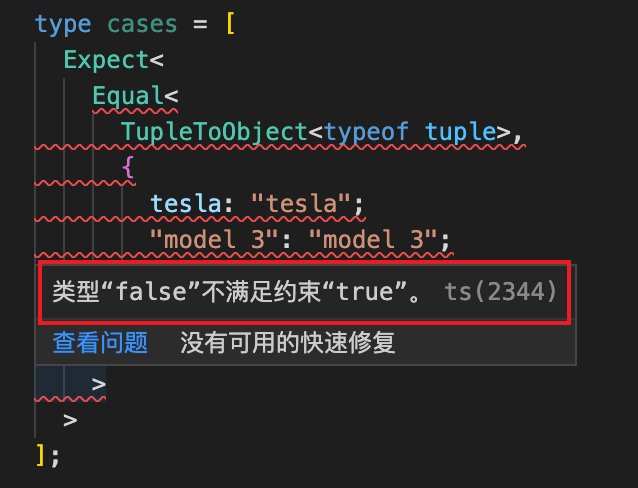

<div style='width: 100%; margin: 0 auto;'><a href='https://github.com/type-challenges/type-challenges/blob/main/questions/00011-easy-tuple-to-object/README.md' target='_blank'></a></div>

# 题目注解

根据题目介绍，我们需要把数组转化为对象类型，类型中的 key 和 type 都是数组的值。

## typeof 和 as const

在 `test-cases` 中，有两个关键的地方，

```
const tuple = ["tesla", "model 3", "model X", "model Y"] as const;

TupleToObject<typeof tuple>
```

这里的 `typeof` 和 `as const` 都是做什么用的呢？

我们先来看 [typeof](https://www.typescriptlang.org/docs/handbook/2/typeof-types.html#handbook-content)。TypeScript 是这样解释的，

> TypeScript adds a typeof operator you can use in a type context to refer to the type of a variable or property.
>
> ... Specifically, it’s only legal to use typeof on _identifiers_ (i.e. variable names) or _their properties_.

意思就是说，通过 `typeof` 操作符，我们可以获取到一个变量或者属性的类型。这就意味着我们可以把 JS 暗含的类型转换为 TS，在 TS 中使用。以测试用例的代码为例，

```
const tuple = ["tesla", "model 3", "model X", "model Y"];
type a = typeof tuple;
```

这里返回 a 的类型就是 `string[]`。注意这里我们没有加上 `as const` ，测试用例这个时候报错了，



这是因为我们转换的类型结果是 `string[]`，而不是特定的值，如果我们修改了 tuple 中的某项（如 `tuple[0] = 'gracewalk'` ），通过 `TupleToObject<typeof tuple>` 转换的结果与测试用例预期的结果就不一样了。

```
const tuple = ["tesla", "model 3", "model X", "model Y"] as const;
type a = typeof tuple;
```

当我们加上 `as const` 之后，a 的类型变成了 `readonly ["tesla", "model 3", "model X", "model Y"]`，这就表示 `tuple` 数组上的值是只读的。此时，如果我们再通过 `tuple[0] = 'gracewalk'` 尝试去修改，就会报错 `无法分配到 "0" ，因为它是只读属性。`。

## 遍历 Tuple Type

TypeScript 对数组类型的定义有两大类： `Array Type` 和 `Tuple Type`，后者通常叫做 `元组`。下面是 `Tuple Type` 的定义，

> A tuple type is another sort of Array type that knows exactly how many elements it contains, and exactly which types it contains at specific positions.

通过前两个题目我们知道可以通过 `keyof K` 来遍历联合类型，但是通过这种方法去遍历数组类型拿到的是数组的下标。遍历数组的写法是 `T[number]`。

```
type TupleToObject<T extends readonly any[]> = {
  [K in T[number]]: K;
};
```

我们已经通过了第一个测试用例，但是第二个测试用例没有通过。该用例传入的类型是 `[[1, 2], {}]`。所以，我们需要限制 `TupleToObject<T>` 中 `T` 传入的类型是 `string[]` 。

```
type TupleToObject<T extends readonly string[]> = {
  [K in T[number]]: K;
};
```

该用例通过。
